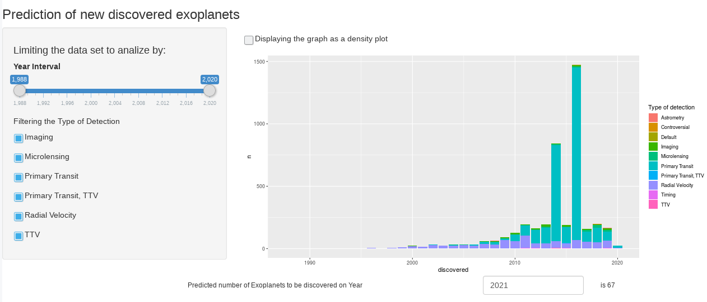

```{r setup, include=FALSE}
knitr::opts_chunk$set(echo = FALSE)
```

## Introduction

```{r introbild, echo=FALSE, fig.cap="", out.width = '30%'}

```

- An exoplanet is a planet outside the Solar System.

- In 1917 was noted the first possible evidence of an exoplanet, but it wasn't not recognized as such.

- The first confirmation of detection occurred in 1992 of a planet originally detected in 1988.
  
- By 2020 are more than 4 000 confirmed exoplanets in more than 3 000 systems.


## Motivation

The Motivation of the "Exoplanets Predictor" is to predict how many exoplanets will be discovered based on the frecuency of confirmations and detection type.

The data is provided by **The Extrasolar Planets Encyclopaedia**, whom provide a tidy data set as a [CSV-File](http://exoplanet.eu/catalog)

The catalog delivery escential information of the planets such as

- Name
- Mass
- Discovery date
- Detection type

## Confirmation clustering

By 29th february 2020 the status of the distribution of number of discoveries by year and type of detection is
```{r discoveries, echo = FALSE, include=FALSE}
library(readr)
library(ggplot2)
exoplanet_catalog <- read_csv("data/exoplanet.eu_catalog.csv")
        e <- ggplot(exoplanet_catalog, aes(y=detection_type,x=discovered))
        e <- e + geom_count( aes(colour=..n.., size=..n..), show.legend=NA, na.rm=TRUE )
        e <- e + labs( x='Year of Discovery', y='Detection Type' )
        
```
```{r confirmations}
print(e)
```

## Prediction Tool

The [Prediction Tool](https://batfing.shinyapps.io/exoplanets/) made prossible estimations of how many exoplanets will be discovered in the future.

It is possible to restrict the data set by year as well to deactivate the influence of the most weighted types of detection.


```{r pressure, echo=FALSE, fig.cap="", out.width = '100%'}

```
